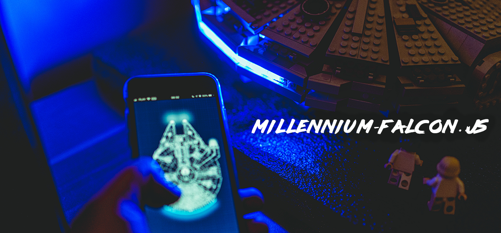

# Millennium-Falcon.js

Code that makes my Falcon alive 😎

## Features

- Static PWA with state synchronization
- Raspberry PI Zero W with BalenaOS 
- Syncano middleware for handling websockets for controlling the Falcon from any place in a galaxy

## See it in action

- [PWA controller](https://www.youtube.com/watch?v=DvYkgEYkRgY)
- [GitHub notifications](https://www.youtube.com/watch?v=b4i_dZ_K0iQ) - yes, if you leave a star here, or at any of my repositories - I'll be notified 🔔
